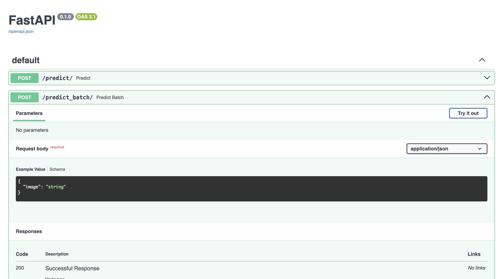
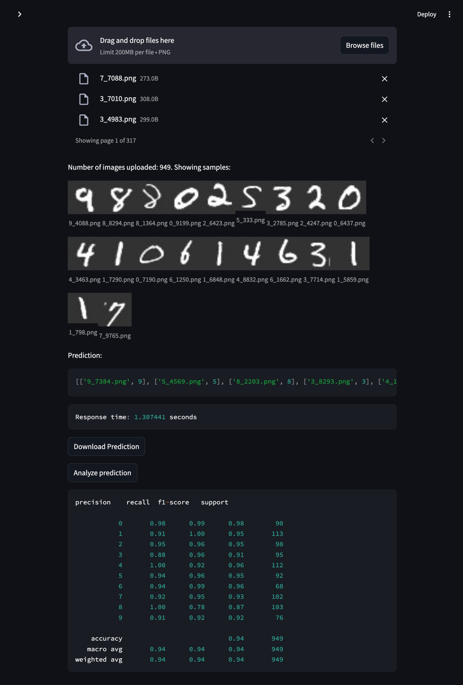

### Installing the environment

```bash
pip install -r requirements.txt
```

### Train

```bash
python model/train.py
```

### Run FastAPI prediction backend

```bash
cd prediction_api
export MODEL_PATH=../model_registry/latest/scripted_model.pt
uvicorn prediction_api.main:app --reload
```



### Run Streamlit frontend
(open another terminal)

```bash
cd ui_app
streamlit run app.py
```

