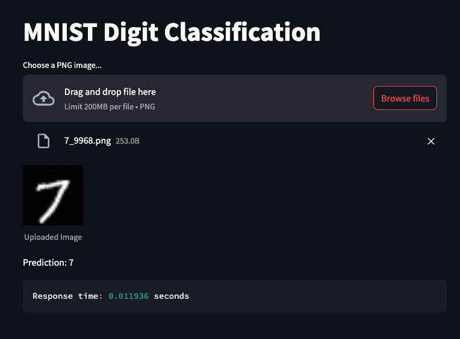

## 20240809

### Planning
Currently, this project has completed the proof-of-concept stage, including a few components:
- Model training scripts in `model/`
- A prediction backend built on FastAPI (`prediction_api`)
- A graphical interface that allows user to upload an image, get the model's prediction of the image and the response time of the model.

Assuming the prototype helps us get the green-light to move the project forward, a lot more will need to be done to make sure it is production-ready:
1. Identify edge cases (minority classes, noisy image) and create test cases accounting for them --> New page on Streamlit for testing of different cases
2. Set up model lifecycle platform to iterate and improve the model systematically --> Applying MLFlow
3. Deploy model to production (Docker container, CI/CD with Github actions)
4. Setup ML monitoring system

### Edge cases and test cases

We can prepare test sets for 3 hypothetical edge cases (potentially out-of-distribution test data):
- Unbalanced class: One class is much less prevalance than others
- Noisy images: Input has additional Gaussian noise with an std of 50 pixel brightness
- Images too bright: Input has increased brightness

## 20240812

Currently, the test cases are completed: 
- 3 test dataset, each with 1000 images
- Batch evaluation front-end with basic classification report
- Batch prediction back-end
- Pytest test cases used to test model accuracy

Now we can move on to step 2: Set up model lifecycle